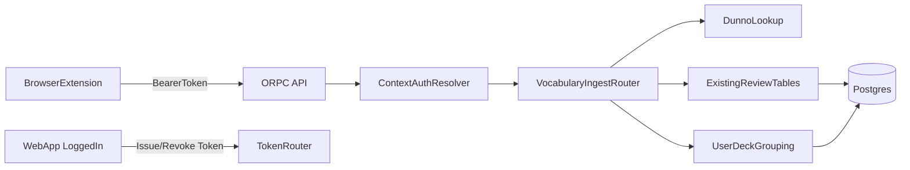

# Browser Extension + Existing Review Model Plan

## Scope Locked

- Keep review compatibility: extension-added words must land in the existing `vocabularies`/review flow.
- Deck choice for user remains supported (select existing deck or create new deck grouping).
- Extension auth uses **web login + issued API token**.

## Architecture Changes

- Add token-auth path in API context so extension calls can be authorized via `Authorization: Bearer <token>` in [`/home/dev/Documents/trektoiec/packages/api/src/context.ts`](/home/dev/Documents/trektoiec/packages/api/src/context.ts), while preserving cookie session behavior.
- Add extension-focused procedures under router registration in [`/home/dev/Documents/trektoiec/packages/api/src/routers/index.ts`](/home/dev/Documents/trektoiec/packages/api/src/routers/index.ts).
- Reuse existing vocabulary + review data paths instead of building a separate review domain.

## Data Model Strategy

- Keep existing vocabulary entities in [`/home/dev/Documents/trektoiec/packages/db/src/schema/vocabulary.ts`](/home/dev/Documents/trektoiec/packages/db/src/schema/vocabulary.ts) as the source for review eligibility.
- Keep/extend user deck grouping based on existing deck concept in [`/home/dev/Documents/trektoiec/packages/db/src/schema/deck-of-user.ts`](/home/dev/Documents/trektoiec/packages/db/src/schema/deck-of-user.ts).
- Add only token storage table (`user_api_tokens`) for extension auth.
- If needed, add a lightweight mapping table to connect user-created deck labels to category/vocabulary IDs without changing review core tables.

## Backend API Additions

- Add token management router in `packages/api/src/routers/`:
  - `createToken` (web-auth required, returns plain token once).
  - `listTokens`.
  - `revokeToken`.
- Add extension ingestion router in `packages/api/src/routers/`:
  - `listDecks`.
  - `createDeck`.
  - `addWordFromSelection` (input: selected word, optional `deckId`, optional `newDeckName`, optional `sourceUrl`).
  - `addWordFromSelection` behavior:
    - query Dunno,
    - normalize data,
    - upsert into existing vocabulary path so review APIs continue to work,
    - link word into chosen/created user deck grouping.
- Reuse Dunno integration from [`/home/dev/Documents/trektoiec/packages/api/src/routers/vocabularies.ts`](/home/dev/Documents/trektoiec/packages/api/src/routers/vocabularies.ts) and [`/home/dev/Documents/trektoiec/packages/schemas/src/dunno-schema.ts`](/home/dev/Documents/trektoiec/packages/schemas/src/dunno-schema.ts).

## Auth + Security

- Extend context resolver in [`/home/dev/Documents/trektoiec/packages/api/src/context.ts`](/home/dev/Documents/trektoiec/packages/api/src/context.ts):
  - First try cookie session (existing).
  - Fallback: validate bearer token hash from `user_api_tokens`, resolve user session-like context.
- Keep `requiredAuthProcedure` behavior unchanged; token-auth should satisfy `context.session.user` contract in [`/home/dev/Documents/trektoiec/packages/api/src/middlewares/required-auth.ts`](/home/dev/Documents/trektoiec/packages/api/src/middlewares/required-auth.ts).
- Update CORS/trusted origins config for extension origins in [`/home/dev/Documents/trektoiec/packages/auth/src/index.ts`](/home/dev/Documents/trektoiec/packages/auth/src/index.ts).

## Extension App (New Workspace App)

- Create `apps/extension` (Manifest V3) with:
  - `content script`: capture highlighted text and open action UI.
  - `side panel` or `popup`: show selected word, Dunno preview, deck selector, create deck inline.
  - `background/service worker`: secure token storage + API calls.
- Flow in extension:
  - User highlights word -> triggers extension UI.
  - Extension calls `listDecks`.
  - User selects deck or creates new one.
  - Extension calls `addWordFromSelection` -> backend fetches Dunno -> writes into existing vocabulary/review-compatible data path -> links to selected deck.

## Web App UI (Token Issuance)

- Add a small settings page/section in web app (new route under protected area) to:
  - Generate extension token.
  - Show active tokens and revoke.
  - Copy token once (with warning).

## Validation + Rollout

- Add schemas for new API contracts in `packages/schemas/src/` and register exports.
- Add integration tests for:
  - token creation/validation/revocation,
  - add-word idempotency (avoid duplicate word links in same deck),
  - extension-added word appears in existing review due-list flow,
  - unauthorized extension calls.
- Manual E2E test:
  - login web -> create token -> paste token in extension -> highlight word on external site -> choose/create deck -> verify word saved and can be reviewed via current review screen.
